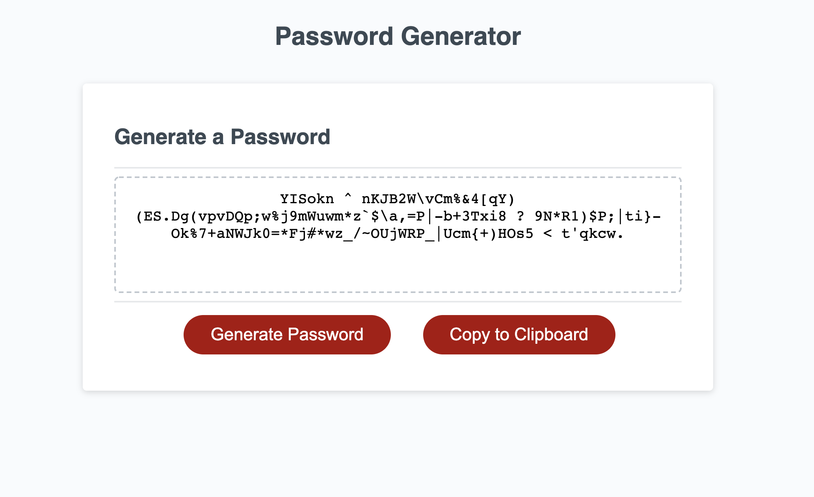

PASSWORD GENERATOR


Description:

In this assignment we had to create a password generator that created a random string of characters, lowercase letters, uppercase letters and numbers.
I went through several different version of this and ended up with the code you see here. This will randomize an array then print after the criteria 
is selected by the user. In another version that I was working on, I was using char codes to represent the arrays instead of actually typing out the 
array. That is still a work in progress. I went with this one becuase it was closer to what we learned before the homework. Below you will find the 
acceptance criteria for the assignment. 

This one was a challenge, but at the end of the assignment I had a better understanding of what is actually happening in the code. Looking forward 
to our next assignemts. 

## User Story

```
AS AN employee with access to sensitive data
I WANT to randomly generate a password that meets certain criteria
SO THAT I can create a strong password that provides greater security

## Acceptance Criteria

```
- GIVEN I need a new, secure password
- WHEN I click the button to generate a password
- THEN I am presented with a series of prompts for password criteria
- WHEN prompted for password criteria
- THEN I select which criteria to include in the password
- WHEN prompted for the length of the password
- THEN I choose a length of at least 8 characters and no more than 128 characters
- WHEN asked for character types to include in the password
- THEN I confirm whether or not to include lowercase, uppercase, numeric, and/or special characters
- WHEN I answer each prompt
- THEN my input should be validated and at least one character type should be selected
- WHEN all prompts are answered
- THEN a password is generated that matches the selected criteria
- WHEN the password is generated
- THEN the password is either displayed in an alert or written to the page


Passwork Generator Link:
https://xboboyx.github.io/password-generator/


